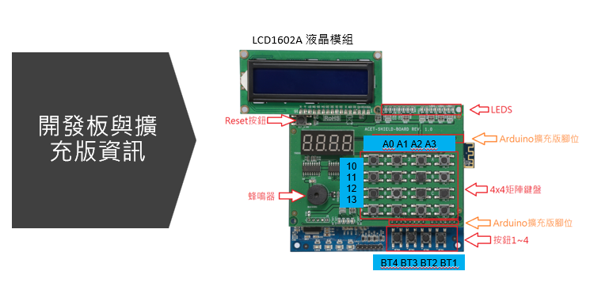
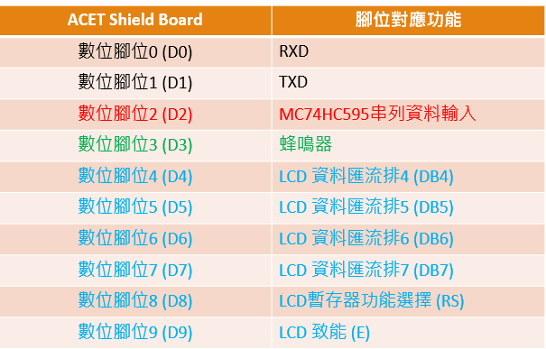
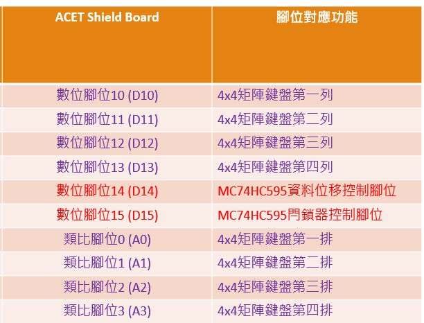

## 晶心科高級證照
### 實作題目
- 記得題目用到的函數庫和要呼叫的函數完整名稱
- 清楚題意，再來寫程式
- 若實際考題有變化，自己要會變通
- 不管執行效率如何，能在有限的時間完成都好
- 有些題目要處理按鍵訊號彈跳問題

| 編號 | 題目說明 | 補充 |
|:-:|:-:|:-:|
|[1](ANDES_Q1_TEST/ANDES_Q1_TEST.ino)|奇偶數 LED 各自閃一次，接者一條連續閃，循環|digitalWrite、delay|
|[2](ANDES_Q2_TEST/ANDES_Q2_TEST.ino)|按鍵 BTN4~1 分別顯示七段顯示器 BCD`6,5,3,3`，按鍵 A0 顯示連續 BCD`8`左移|digitalRead、shiftOut|
|[3](ANDES_Q3_TEST/ANDES_Q3_TEST.ino)|LCD 顯示字串 `Andes Hello!`|`LiquidCrystal`、setCursor|
|[4](ANDES_Q4_TEST/ANDES_Q4_TEST.ino)|4x4陣列鍵盤字元顯示到 LCD|`LiquidCrystal`|
|[5](ANDES_Q5_TEST/ANDES_Q5_TEST.ino)|LCD顯示`x年x月x日x時x分x秒`，並可以隨時間變化|`LiquidCrystal`、`RTC`、settime、startcounting|
|[6](ANDES_Q6_TEST/ANDES_Q6_TEST.ino)|蜂鳴器播放音樂|tone、noTone|
|[7](ANDES_Q7_TEST/ANDES_Q7_TEST.ino)|串列埠傳送並得到回應|Serial、read|
|[8](ANDES_Q8_TEST/ANDES_Q8_TEST.ino)|按下按鍵`S17`啟動中斷服務，在串列埠顯示次數|Serial、attachInterrupt、noInterrupts、interrupts|
|[9](ANDES_Q9_TEST/ANDES_Q9_TEST.ino)|`LED13`點亮五秒暗，循環|`FlexiTimer2`無用|
### 開發板與擴充板資訊

以下為開發板與擴充板的元件與功能說明：
- **LCD1602A 液晶模組**：用於顯示文字與數據。
- **Reset 按鈕**：重置開發板。
- **蜂鳴器**：可用於發出聲音提示。
- **4x4 矩陣鍵盤**：提供 16 個按鍵輸入。
- **LED 指示燈**：用於顯示狀態。
- **按鈕 BT1 ~ BT4**：提供額外的按鍵輸入。
- **腳位圖**

### 筆試筆記
- [參考別人的題目整理](https://hackmd.io/@jddj42840/ByiFzq7Lj)
- 列舉自己容易錯的題目

|編號|題目|A|B|C|D|答案|
|:-:|:-:|:-:|:-:|:-:|:-:|:-:|
|1|下列何者RISC-V 指令集的字組大小無法支援|16|32|64|128|A|
|7|下列何者DLM base設定是正確的?當DLM size=16KB|0x0000_4000|0x0000_C000|0x0000_5000|0x0000_D000|AB|
|11|nds32le-elf-nm.exe 的功能是什麼|印出執行檔的組合語言|減少執行檔的 code size|觀察 object file 的符號表|印出 elf 格式的各個 section 資訊|C|
|17|下列何者功能是 Linux Kernel Features on RISC-V AndesCore™|MMU Support|User Space Cache Control|PLIC Support|Unaligned Acess Exception Handling|ABCD|
|22|下列何者可為 Linux 的 root filesystem format|Jffs2/Jffs3|Ext2/Ext3|NTFS|squashfs|C|
|25|下列何者 ICE 的 JTAG 支援 RISC-V/V5 CPU|AICE-MCU|AICE-MINI+|AICE-MICRO|Bus Blaster v3|BCD|
|27|下列何者 AndesCore™ RISC-V CPU 為 64 bits cpu|N25F|NX25F|D25F|A25|B|
|28|下列何者 RISC-V CPU 是 8-stage pipeline|N22|N25F|A25|A45|D|
|32|下列哪個 RISC-V CPU1 是 5-stage pipeline|N22|N25F|A25|AX25|BCD|
|33|下列何者 CPU 沒有支援 32GPR|N8|N22|N25F|NX25F|A|
|36|下列何者 CPU 支援 AXI BUS|N22|N25F|A25|AX25|BCD|
|37|N25F 最大可 configure 的 DLM Size 為何|8KIB|512KIB|16MIB|32MIB|C|
|38|下列何者 CPU 支援 ILM/DLM Interface|N22|N25F|N27|A25|ABCD|
|60|ADP-XC7K160 開發板支援那一種作業系統|Linux|Unix|Android|Windows XP|A|
|63|CPU架構之中 pipeline(管線)級數多寡與總工作量(throughput)的差異|級數越多總工作量相同|級數越多總工作量越少|級數越多總工作量越多|級數不影響工作量|C|
|65|下列何者是RISC-V CPU所能支援的作業系統|Nucleus|Android|Free RTOS|uC-OS II|ABCD|
|72|AE350 platform 的 BUS matrix 無以下那一feature|AX14 相容|AHB Lite 相容|支援16bits data width|支援 32bits address width|D|
|73|A27可以configure的Multiplier Implementation選擇很多，下列何者不是|radix2|radix32|radix256|fast|B|
|74|N25 兩個32bits乘法指令cycle數目為以下那個數字|1|36|17|3|A|
|78|N22 的 BUS 介面支援以下那些 BUS 架構|AHB32|PCI|AHB64|AXI|A|
|82|下列何者標準擴充指令集名稱在描述：dsp指令集架構|M|P|Q|L|B|
|83|下列何者不是AndeShape™ AICE-MINI+ 和 AICE-MICRO 的 feature|400kHz JTAG speed|16MHZ JTAG speed|Serial 2 wire debug interface|JTAG 4 wire debug interface|D|

- **名詞解釋**
  - wfi (Wait For Interrupt) CPU 進入省電模式
  - NTFS 為 Windows 的 root filesystem format 
  - ILM 指令本地儲存器
  - DLM 數據本地儲存器
  - N2"2" IS 2-STAGE PIPELINE
  - N2"5"F、A2"5"、AX2"5" ARE 5-STAGE PIPELINE
  - A45 IS 8-STAGE PIPELINE (例外)
  - File system management 不是 CPU 資源管理的必備功能

### 進度
- [x] 做實作題目
- [x] 背筆試題目
- [ ] 隨機抽題測試